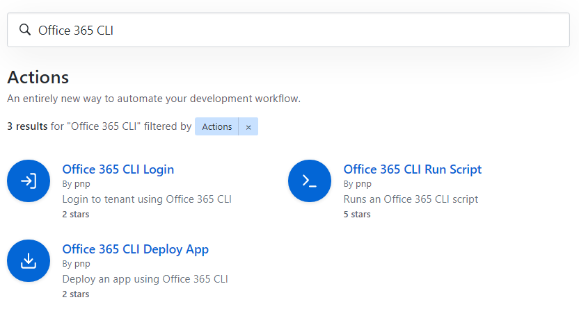
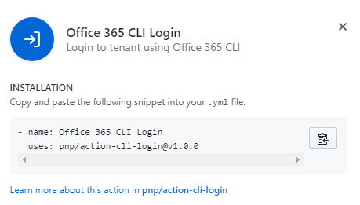

# Automate your CI/CD workflow using Office 365 CLI GitHub actions

GitHub Actions is a new feature from GitHub that makes it easy to automate software workflows, now with world-class CI/CD. Along with the actions feature, GitHub introduced the actions marketplace. We are happy to share that Office 365 CLI has GitHub actions already published to make your Microsoft 365 automation CI/CD and [workflows](https://help.github.com/en/articles/configuring-a-workflow#creating-a-workflow-file) as straightforward as possible.

 [](../images/github-actions-office365-cli.png)


## How can I add Office 365 CLI action to my CI/CD pipeline?

It is easy, just find the Office 365 CLI actions from the market place at this URL [https://github.com/marketplace?utf8=%E2%9C%93&type=actions&query=Office+365+CLI](https://github.com/marketplace?utf8=%E2%9C%93&type=actions&query=Office+365+CLI)

- Select the Office 365 action
- Click on the 'Use latest version' button 

 [](../images/github-actions-office365-cli-use.png)

- It will open a code snippet that can be copied to your workflow YAML action file

 [](../images/github-actions-office365-cli-snippet.png)

## How to use the Office 365 Deploy action?

### Pre-requisites
Create a workflow `.yml` file in your `.github/workflows` directory. For more information, reference the GitHub Help Documentation for [creating a workflow file](https://help.github.com/en/articles/configuring-a-workflow#creating-a-workflow-file).

### Dependencies on other GitHub Actions

- [Office 365 CLI Login](https://github.com/pnp/action-cli-login) – **Required** . This action is dependant on `action-cli-login`. So in the workflow we need to run  `action-cli-login` before using this action.

#### Optional requirement
Since `action-cli-login` requires user name and password which are sensitive pieces of information, it would be ideal to store them securely. We can achieve this in a GitHub repo by using [secrets](https://help.github.com/en/actions/automating-your-workflow-with-github-actions/creating-and-using-encrypted-secrets). So, click on `settings` tab in your repo and add 2 new secrets:
- `adminUsername` - store the admin user name in this (e.g. user@contoso.onmicrosoft.com)
- `adminPassword` - store the password of that user in this.
These secrets are encrypted and can only be used by GitHub actions.

### Inputs
- `APP_FILE_PATH` : **Required** Relative path of the app in your repo
- `SCOPE` : Scope of the app catalog: `tenant|sitecollection`. Default is `tenant`
- `SITE_COLLECTION_URL` : The URL of the site collection where the solution package will be added. Required if scope is set to `sitecollection`
- `SKIP_FEATURE_DEPLOYMENT` : `true|false` If the app supports tenant-wide deployment, deploy it to the whole tenant. Default is `false`
- `OVERWRITE` : `true|false` Set to overwrite the existing package file. Default is `false`

### Output
- `APP_ID` : The id of the app that gets deployed

### Example workflow - Office 365 CLI Deploy
On every `push` build the code, then login to Office 365 and then start deploying.

```yaml
name: SPFx CICD with O365 CLI

on: [push]

jobs:
  build:
    ##
    ## Build code omitted
    ##
        
  deploy:
    needs: build
    runs-on: ubuntu-latest
    strategy:
      matrix:
        node-version: [10.x]
    
    steps:
    
    ##
    ## Code to get the package omitted
    ##

    # Office 365 cli login action
    - name: Login to tenant
      uses: pnp/action-cli-login@v1.0.0
      with:
        ADMIN_USERNAME:  ${{ secrets.adminUsername }}
        ADMIN_PASSWORD:  ${{ secrets.adminPassword }}
    
    # Office 365 cli deploy app action
    # Use either option 1 or option 2
    
    # Option 1 - Deploy app at tenant level
    - name: Option 1 - Deploy app to tenant
      id: o365clideploy # optional - use if output needs to be used
      uses: pnp/action-cli-deploy@v1.0.0
      with:
        APP_FILE_PATH: sharepoint/solution/spfx-o365-cli-action.sppkg
        SKIP_FEATURE_DEPLOYMENT: true
        OVERWRITE: true
    # Option 1 - ends
     
    # Option 2 - Deploy app to a site collection
    - name: Option 2 - Deploy app to a site collection
      uses: pnp/action-cli-deploy@v1.0.0
      with:
        APP_FILE_PATH: sharepoint/solution/spfx-o365-cli-action.sppkg
        SCOPE: sitecollection
        SITE_COLLECTION_URL: https://contoso.sharepoint.com/sites/teamsite
    # Option 2 - ends

    # Print the id of the app
    - name: Get the id of the app deployed
      run: echo "The id of the app deployed is ${{ steps.o365clideploy.outputs.APP_ID }}"
```

### Contributions and issues

If you have any ideas or issues regarding the action you can use our issues list [https://github.com/pnp/action-cli-deploy/issues](https://github.com/pnp/action-cli-deploy/issues)

## How to use the Office 365 Run Script action?

### Pre-requisites
Create a workflow `.yml` file in `.github/workflows` directory of your repo. For more information, reference the GitHub Help Documentation for [creating a workflow file](https://help.github.com/en/articles/configuring-a-workflow#creating-a-workflow-file).

### Dependencies on other GitHub Actions

- [Office 365 CLI Login](https://github.com/pnp/action-cli-login) – **Required** . This action is dependant on `action-cli-login`. So in the workflow we need to run  `action-cli-login` before using this action.

#### Optional requirement
Since `action-cli-login` requires user name and password which are sensitive pieces of information, it would be ideal to store them securely. We can achieve this in a GitHub repo by using [secrets](https://help.github.com/en/actions/automating-your-workflow-with-github-actions/creating-and-using-encrypted-secrets). So, click on `settings` tab in your repo and add 2 new secrets:
- `adminUsername` - store the admin user name in this (e.g. user@contoso.onmicrosoft.com)
- `adminPassword` - store the password of that user in this.
These secrets are encrypted and can only be used by GitHub actions.

### Inputs
- `O365_CLI_SCRIPT_PATH` : Relative path of the script in your repo.
- `O365_CLI_SCRIPT` : The script to run
- `IS_POWERSHELL` : `true|false` Used only with O365_CLI_SCRIPT. If true the assumption is the script passed in O365_CLI_SCRIPT will be a PowerShell script, otherwise the assumption is bash script. Default is false

One of `O365_CLI_SCRIPT_PATH` / `O365_CLI_SCRIPT` is mandatory, in case both are defined `O365_CLI_SCRIPT_PATH` gets preference.

### Example workflow - Office 365 CLI Runscript
On every `push` build the code, then deploy and then send an email using Office 365 CLI Runscript action.

```yaml
name: SPFx CICD with O365 CLI

on: [push]

jobs:
  
  runscript:
    runs-on: ubuntu-latest
    strategy:
      matrix:
        node-version: [10.x]
    
    steps:
    
    # Office 365 cli login action
    - name: Login to tenant
      uses: pnp/action-cli-login@v1.0.0
      with:
        ADMIN_USERNAME:  ${{ secrets.adminUsername }}
        ADMIN_PASSWORD:  ${{ secrets.adminPassword }}
    
    # Office 365 CLI runscript action option 1 (single line of script as input)
    - name: Send email
      uses: pnp/action-cli-runscript@v1.0.0
      with:
        O365_CLI_SCRIPT: o365 spo mail send --webUrl https://contoso.sharepoint.com/sites/teamsite --to 'user@contoso.onmicrosoft.com' --subject 'Deployment done' --body '<h2>Office 365 CLI</h2> <p>The deployment is complete.</p> <br/> Email sent via Office 365 CLI GitHub Action.'
    
    # Office 365 CLI runscript action option 2 (script file as input)
    - name: Create lists
      uses: pnp/action-cli-runscript@v1.0.0
      with:
        O365_CLI_SCRIPT_PATH: ./script/lists.ps1 
        #lists.ps1 will have all the required Office 365 CLI commands
```

### Contributions and issues

If you have any ideas or issues regarding the action you can use our issues list [https://github.com/pnp/action-cli-runscript/issues](https://github.com/pnp/action-cli-runscript/issues)